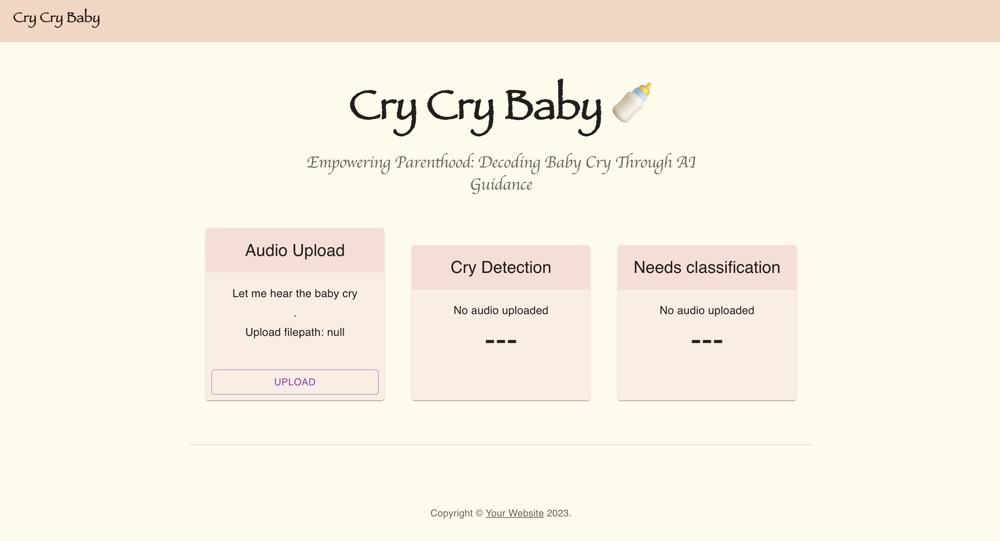
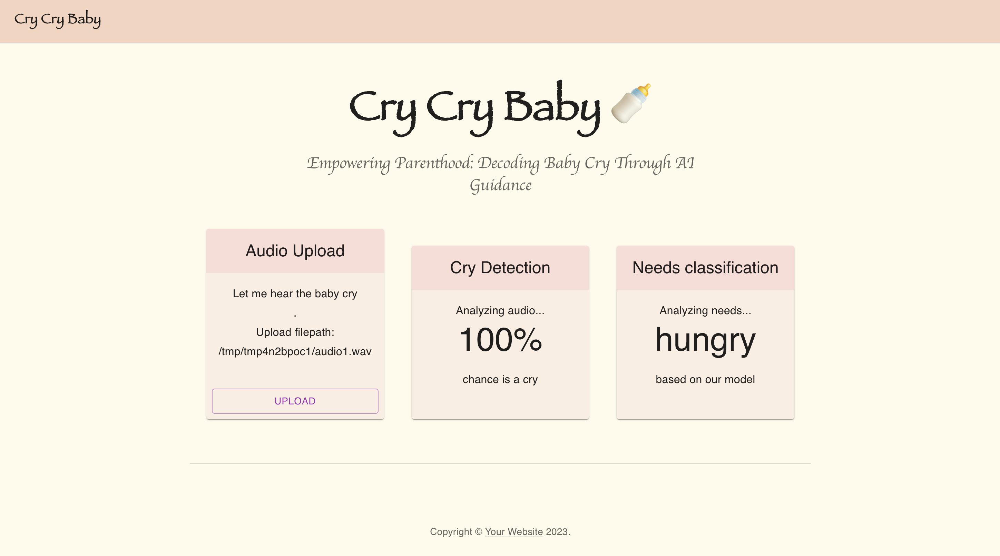

AC215 - Cry Cry Baby🍼
==============================
### Presentation  Video
* https://youtu.be/um-LaY7apFI

### Blog Post Link (Draft Link)
* https://medium.com/@tingweishen/cry-cry-baby-deciphering-baby-cries-e97fec9d776a
---

Project Organization
-------------------
    ├── LICENSE
    ├── Pipfile
    ├── README.md
    ├── images
    │   ├── architecture
    │   │   ├── sol_archi.png
    │   │   └── tech_archi.png
    │   ├── deployed_vm.png
    │   ├── docs0.png
    │   ├── docs1.png
    │   ├── docs2.png
    │   ├── frontend
    │   │   ├── frontend-1.png
    │   │   └── frontend-2.png
    │   ├── k8s.png
    │   ├── pruning
    │   │   ├── after_acc.jpg
    │   │   ├── after_space.jpg
    │   │   ├── after_zeros.jpg
    │   │   ├── before_acc.jpg
    │   │   ├── before_space.jpg
    │   │   └── before_zeros.jpg
    │   └── wandb.png
    ├── notebooks
    │   ├── crycrybaby_poc_cleaned.ipynb
    │   ├── crycrybaby_poc_wandb.ipynb
    │   ├── model1.ipynb
    │   └── model2.ipynb
    └── src
        ├── api-service
        │   ├── Dockerfile
        │   ├── Pipfile
        │   ├── Pipfile.lock
        │   ├── api
        │   │   ├── download_models.py
        │   │   ├── inference.py
        │   │   ├── service.py
        │   │   ├── test_cry.wav
        │   │   ├── test_inference.py
        │   │   └── test_wav_upload.py
        │   ├── docker-custom-entrypoint.sh
        │   ├── docker-shell-interactive.sh
        │   ├── docker-shell.bat
        │   ├── docker-shell.sh
        │   ├── model1_v1.h5
        │   └── model2_v1.h5
        ├── deployment
        │   ├── Dockerfile
        │   ├── Dockerfile.dev
        │   ├── Pipfile
        │   ├── Pipfile.lock
        │   ├── adam_notes.txt
        │   ├── cli.py
        │   ├── deploy-app.sh
        │   ├── deploy-create-instance.yml
        │   ├── deploy-docker-images-ml.yml
        │   ├── deploy-docker-images.yml
        │   ├── deploy-k8s-cluster.yml
        │   ├── deploy-provision-instance.yml
        │   ├── deploy-setup-containers.yml
        │   ├── deploy-setup-webserver.yml
        │   ├── docker-entrypoint.sh
        │   ├── docker-shell-ml.sh
        │   ├── docker-shell.bat
        │   ├── docker-shell.sh
        │   ├── inventory-prod.yml
        │   ├── inventory.yml
        │   ├── nginx-conf
        │   │   └── nginx
        │   │       └── nginx.conf
        │   ├── run-ml-pipeline.sh
        │   └── update-k8s-cluster.yml
        ├── docker-compose.yml
        ├── download_from_dac
        │   ├── Dockerfile
        │   ├── Pipfile
        │   ├── Pipfile.lock
        │   ├── cli.py
        │   ├── docker-entrypoint.sh
        │   ├── docker-shell-ml.sh
        │   ├── docker-shell.sh
        │   └── download_from_dac.py
        ├── frontend-react
        │   ├── Dockerfile
        │   ├── Dockerfile.dev
        │   ├── conf
        │   │   ├── default.conf
        │   │   └── nginx
        │   │       └── nginx.conf
        │   ├── docker-custom-entrypoint.sh
        │   ├── docker-shell-prod.sh
        │   ├── docker-shell.bat
        │   ├── docker-shell.sh
        │   ├── package-lock.json
        │   ├── package.json
        │   ├── public
        │   │   ├── favicon.ico
        │   │   ├── index.html
        │   │   └── manifest.json
        │   ├── src
        │   │   ├── app
        │   │   │   └── App.js
        │   │   ├── images
        │   │   │   └── img.jpg
        │   │   ├── index.css
        │   │   ├── index.js
        │   │   └── services
        │   │       ├── Common.js
        │   │       └── DataService.js
        │   └── yarn.lock
        ├── model1
        │   ├── Dockerfile
        │   ├── Pipfile
        │   ├── Pipfile.lock
        │   ├── cli.py
        │   ├── docker-entrypoint.sh
        │   ├── docker-shell-ml.sh
        │   ├── docker-shell.sh
        │   └── model1.py
        ├── model2
        │   ├── Dockerfile
        │   ├── Pipfile
        │   ├── Pipfile.lock
        │   ├── cli.py
        │   ├── docker-entrypoint.sh
        │   ├── docker-shell-ml.sh
        │   ├── docker-shell.sh
        │   └── model2.py
        └── preprocessing
            ├── Dockerfile
            ├── Pipfile
            ├── Pipfile.lock
            ├── cli.py
            ├── docker-entrypoint.sh
            ├── docker-shell-ml.sh
            ├── docker-shell.sh
            └── preprocessing.py

-------------------
24 directories, 114 files.  

# AC215 - Final Project

**Team Members**
Jessica Gochioco, Jingwen Zhang, Adam Stone, Charline Shen

**Group Name**
Cry Cry Baby

**Project - Problem Definition**
Parenting is a rewarding yet challenging journey that millions of individuals embark on each year. One of the most difficult aspects of caring for a baby is understanding and addressing their needs, especially when they have not yet learned how to talk. Our project centers on the application of the Dunstan Baby Language (DBL) , a concept suggesting that infants possess distinct vocal cues for various needs, and the development of a mobile app that leverages this knowledge. This app aims to empower parents by enabling them to decode their baby's cries and respond effectively, thereby reducing the stress associated with early parenthood. Furthermore, our project envisions a feature to have caretakers self-identify cries in order to add to our dataset, as well as the integration of a chatbot that can offer real-time support and guidance to parents.


## Data Description 
We're implementing two distinct models to optimize app functionality. The first model determines whether an input sound qualifies as a cry at all, while the second one is dedicated to classifying the specific needs associated with a cry. Our labeled dataset is sourced from the [Donate-A-Cry corpus](https://github.com/gveres/donateacry-corpus/tree/master) , meticulously cleaned and annotated with the Dunstan Baby Language as a guiding framework. Additionally, we expand our data resources by incorporating information from diverse sources, including [CryCeleb](https://huggingface.co/datasets/Ubenwa/CryCeleb2023), [CREMA-D](https://github.com/CheyneyComputerScience/CREMA-D), and [ESC50](https://github.com/karolpiczak/ESC-50). This approach enriches our dataset, especially benefiting our binary classifier by providing a broader spectrum of audio data.

## Proposed Solution
After completions of building a robust ML Pipeline in our previous milestone we have built a backend api service and frontend app. This will be our user-facing application that ties together the various components built in previous milestones.


**Cry Cry Baby App**

A user-friendly React app was developed to identify various baby cries using machine learning models from the backend. With the app, users can record an audio file of a baby cry and upload it. The app then sends the audio to the backend API to obtain prediction results on whether the uploaded audio is indeed a baby cry and provides information on why the baby may be crying.

Here is the screenshot of our welcome page:

Here is the screenshot of prediction page:


**Kubernetes Deployment**

We deployed our frontend and backend to a kubernetes cluster to take care of load balancing and failover. We used ansible scripts to manage creating and updating the k8s cluster. Ansible helps us manage infrastructure as code and this is very useful to keep track of our app infrastructure as code in GitHub. It helps use setup deployments in a very automated way.

Here is our deployed app on a K8s cluster in GCP:


### Code Structure
The following are the folders from the previous milestones:
```
- download_from_dac: data colloector
- preprocessing: data processor
- model1: baby cry detection model
- model2: needs classification model
- api-service: backend coordinator
- frontend-react: app frontend
- deployment: auto-deployment via Ansible & Kubernetes
```

**API Service Container**
This container has all the python files to run and expose thr backend apis.

To run the container locally:
- Open a terminal and go to the location where `AC215_CryCryBaby/src/api-service`
- Run `sh docker-shell.sh`
- Once inside the docker container run `uvicorn_server`
- To view and test APIs go to `http://localhost:9000/docs`

**Frontend Container**
This container contains all the files to develop and build a react app. There are dockerfiles for both development and production

To run the container locally:
- Open a terminal and go to the location where `AC215_CryCryBaby/src/frontend-react`
- Run `sh docker-shell.sh`
- Go to `http://localhost:3000` to access the app locally


**Deployment Container**
This container helps manage building and deploying all our app containers. The deployment is to GCP and all docker images go to GCR. 

To run the container locally:
- Open a terminal and go to the location where `AC215_CryCryBaby/src/deployment`
- Run `sh docker-shell.sh`
- Build and Push Docker Containers to GCR (Google Container Registry)
```
ansible-playbook deploy-docker-images.yml -i inventory.yml
```

- Create & Deploy Cluster
```
ansible-playbook deploy-k8s-cluster.yml -i inventory.yml --extra-vars cluster_state=present
```

- View the App
* Copy the `nginx_ingress_ip` from the terminal from the create cluster command
* Go to `http://34.75.108.68.sslip.io/` 🍼🍼🍼

<!-- - ?? Run ML Tasks in Vertex AI ??
* Run `python cli.py --data_collector`, run just the data collector on Vertex AI
* Run `python cli.py --data_processor`, run just the data processor on Vertex AI
* Run `python cli.py --pipeline`, run the entire ML pipeline in Vertex AI -->


 ### Deploy using GitHub Actions

Finally we added CI/CD using GitHub Actions, such that we can trigger deployment or any other pipeline using GitHub Events. Our yaml files can be found under `.github/workflows`

`ci-cd.yml` - We have a GitHub Action that will build and deploy a new version of the app when a git commit has a comment /run-deploy-app

We implemented a CI/CD workflow to use the deployment container to 
* Invoke docker image building and pushing to GCR on code changes
* Deploy the changed containers to update the k8s cluster


