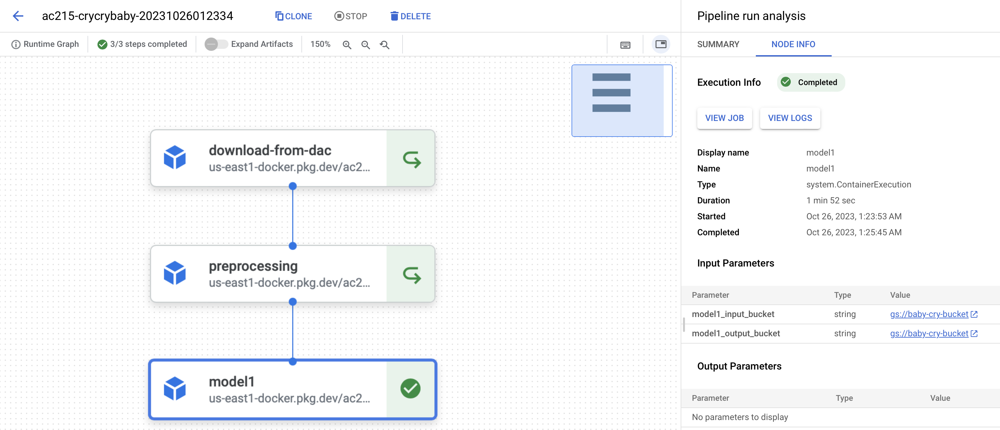
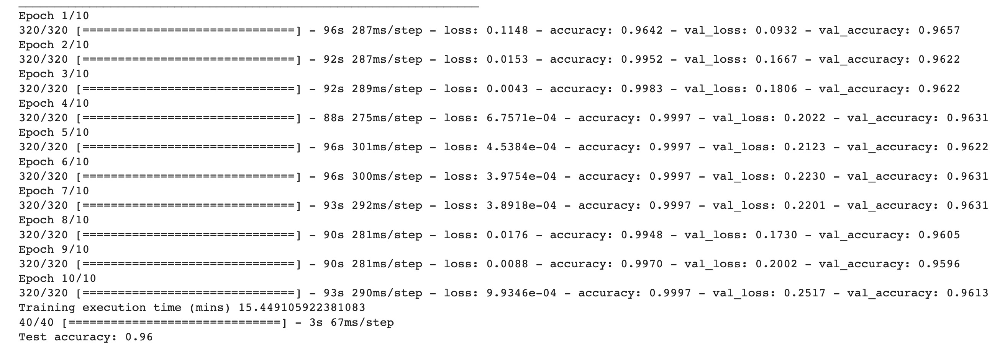
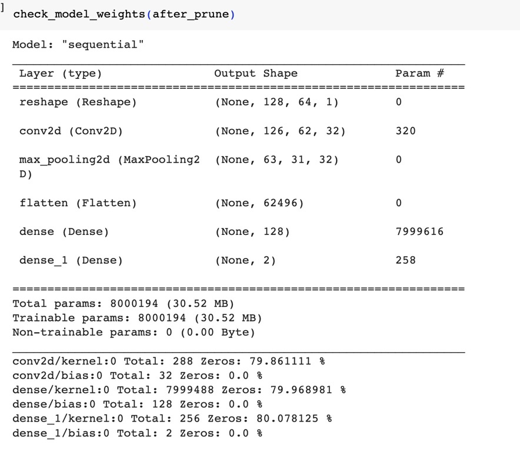
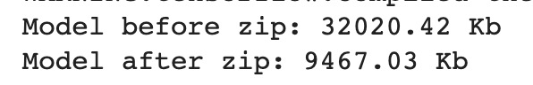
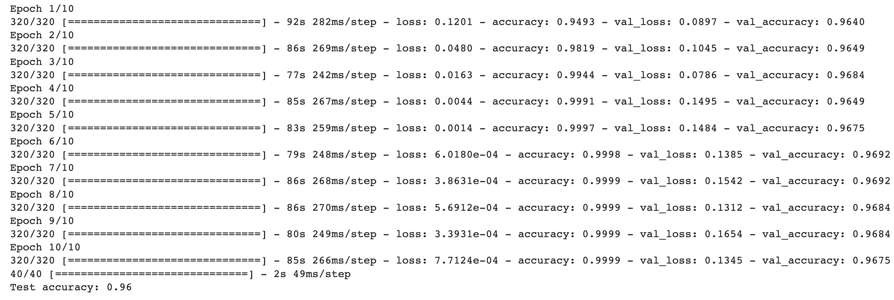
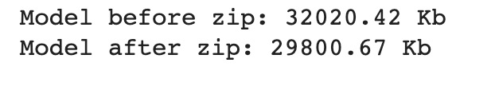

AC215-Milestone5
==============================

AC215 - Milestone5

Project Organization
------------
      ├── LICENSE
      ├── README.md
      ├── requirements.txt
      └── notebooks
            ├── crycrybaby_poc_cleaned.ipynb
            ├── crycrybaby_poc_wandb.ipynb
            ├── model2.ipynb
            ├── model1.ipynb
      └── src
            ├── download_from_dac
            │   ├── Dockerfile
            │   ├── Pipfile
            │   ├── Pipfile.lock
            │   ├── docker-shell.sh
            │   └── download_from_dac.py
            ├── preprocessing
            │   ├── Dockerfile
            │   ├── Pipfile
            │   ├── Pipfile.lock
            │   ├── docker-shell.sh
            │   └── preprocessing.py
            ├── model1
            │   ├── Dockerfile
            │   ├── Pipfile
            │   ├── Pipfile.lock
            │   ├── docker-shell.sh
            │   └── model1.py
            ├── model2
            |   ├── Dockerfile
            │   ├── Pipfile
            │   ├── Pipfile.lock
            │   ├── docker-shell.sh
            │   └── model2.py
            ├── TODO(@Jessica, Adam): api-service
            |   ├── Dockerfile
            │   ├── Pipfile
            │   ├── Pipfile.lock
            │   ├── docker-shell.sh
            │   └── model2.py
            ├── frontend-react
            |   ├── conf
            |   ├── public
            |   ├── src
            |   |   ├── app
            |   |   ├── services
            |   |   ├── index.css
            |   |   ├── index.js
            |   ├── .env.development
            |   ├── .env.production
            │   ├── Pipfile
            │   ├── Pipfile.lock
            │   ├── package-lock.json
            │   ├── package.json
            │   ├── yarn.lock
            │   ├── docker-shell.sh
            │   ├── Dockerfile
            │   └── Dockerfile.dev
  

--------
# AC215 - Milestone5 - Cry Cry Baby

**Team Members**
Jessica Gochioco, Jingwen Zhang, Adam Stone, Charline Shen


**Group Name**
Cry Cry Baby

**Project**
Parenting is a rewarding yet challenging journey that millions of individuals embark on each year. One of the most difficult aspects of caring for a baby is understanding and addressing their needs, especially when they have not yet learned how to talk. Our project centers on the application of the Dunstan Baby Language (DBL) , a concept suggesting that infants possess distinct vocal cues for various needs, and the development of a mobile app that leverages this knowledge. This app aims to empower parents by enabling them to decode their baby's cries and respond effectively, thereby reducing the stress associated with early parenthood. Furthermore, our project envisions a feature to have caretakers self-identify cries in order to add to our dataset, as well as the integration of a chatbot that can offer real-time support and guidance to parents.

## Milestone 5

After completions of building a robust ML Pipeline in our previous milestone we have built a backend api service and frontend app. This will be our user-facing application that ties together the various components built in previous milestones.

**Application Design**

Before we start implementing the app we built a detailed design document outlining the application’s architecture. We built a Solution Architecture abd Technical Architecture to ensure all our components work together.

Here is our Solution Architecture:


Here is our Technical Architecture:


**Backend API**

We built backend api service using fast API to expose model functionality to the frontend. We also added apis that will help the frontend display some key information about the prediction results. 

<!--  -->

**Frontend**

A user friendly React app was built to identify baby cry and different reasons for baby cry. Using the app a user can take an audio of a baby cry and upload it. The app will send the audio to the backend api to get prediction results on the probablity the baby is crying and the reason for baby cry. 

<!-- Here are some screenshots of our app:


 -->

<!-- **Deployment** -->

<!-- We used Ansible to create, provision, and deploy our frontend and backend to GCP in an automated fashion. Ansible helps us manage infrastructure as code and this is very useful to keep track of our app infrastructure as code in GitHub. It helps use setup deployments in a very automated way. -->

<!-- Here is our deployed app on a single VM in GCP:
 -->


### Code Structure

The following are the folders from the previous milestones:
```
- preprocessing
- model1
- model2
- download_from_dac
```

**API Service Container**
This container has all the python files to run and expose thr backend apis.

To run the container locally:
- Open a terminal and go to the location where `src/api-service`
- Run `sh docker-shell.sh`
- Once inside the docker container run `uvicorn_server`
- To view and test APIs go to `http://localhost:9000/`

**Frontend Container**
This container contains all the files to develop and build a react app. There are dockerfiles for both development and production

To run the container locally:
- Open a terminal and go to the location where `src/frontend-react`
- Run `sh docker-shell.sh`
- If running the container for the first time, run `yarn install`
- Once inside the docker container run `yarn start`
- Go to `http://localhost:3000` to access the app locally


<!-- **Deployment**
`docker-compse.yml` is used to deploy all our app containers. The deployment is to GCP and all docker images go to GCR. 

To run the container locally:
- Open a terminal and go to the location where `awesome-app/src/deployment`
- Run `sh docker-shell.sh`
- Build and Push Docker Containers to GCR (Google Container Registry)
```
ansible-playbook deploy-docker-images.yml -i inventory.yml
```

- Create Compute Instance (VM) Server in GCP
```
ansible-playbook deploy-create-instance.yml -i inventory.yml --extra-vars cluster_state=present
```

- Provision Compute Instance in GCP
Install and setup all the required things for deployment.
```
ansible-playbook deploy-provision-instance.yml -i inventory.yml
```

- Setup Docker Containers in the  Compute Instance
```
ansible-playbook deploy-setup-containers.yml -i inventory.yml
```

- Setup Webserver on the Compute Instance
```
ansible-playbook deploy-setup-webserver.yml -i inventory.yml
```
Once the command runs go to `http://<External IP>/`  -->

---

## NOTE

**DO NOT KEEP YOUR GCP INSTANCES RUNNING**

Once you are done with taking screenshots for the milestone bring them down. 


### Milestone4 ###

**Vertex AI Pipeline**

We were able to get the Vertex AI Pipeline working on a subset of our containers. We are still working on cleaning up our system architecture, but here is what we have for now! 


**Model Compression**

We used a model compression technique(model pruning) on model 1. Here are some comparation of before and after pruning models.

Pictures of accuracy, weight analysis, and disk space before Prune:







Pictures of accuracy, weight analysis, and disk space before Prune:







**Preprocess container**
- This container reads all the audio files (in .wav format), translate them into spectrogram (in .npy format), and stores it back to GCP
- Source and destincation GCS location are preset in `preprocessing.py`. Input to this container is secrets files - via docker
- Output from this container stored at GCS location

(1) `src/preprocessing/preprocessing.py`  - Here we first download audio files from GCP,  convert our audio files into numerical representation called spectrogram, normalize each matrices, and save the X & y data for our model on GCS. 

(2) `src/preprocessing/Dockerfile` - This dockerfile starts with  `python:3.8-slim-buster`. This <statement> attaches volume to the docker container and also uses secrets to connect to GCS.

(3) `src/preprocessing/Pipfile` - This file will be used by the Pipenv virtual environment to manage project dependencies.

(4) `src/preprocessing/Pipfile.lock` - This file replaces the requirements. txt file used in most Python projects and adds security benefits of tracking the packages hashes that were last locked

(5) `src/preprocessing/docker-shell.sh` - This shell file grabs credentials from GCP and automates the execution of Dockerfile.


**Data Version Container**
- This container load processed spectrogram files from GCP, double the data data size by adding random noises between 0-0.01, and track data versions via `dvc`. 


(1) `src/dataversion/cli.py`  - Here we first download spectrogram files from GCP, do a simple data augmentation to double the data size, and then upload the versioned data to GCP buckets via `dvc`. 

(2) `src/dataversion/Dockerfile` - This dockerfile starts with  `python:3.8-slim-buster`. This <statement> attaches volume to the docker container and also uses secrets to connect to GCS.

(3) `src/dataversion/Pipfile` - This file will be used by the Pipenv virtual environment to manage project dependencies.

(4) `src/dataversion/Pipfile.lock` - This file replaces the requirements. txt file used in most Python projects and adds security benefits of tracking the packages hashes that were last locked

(5) `src/dataversion/docker-shell.sh` - This shell file grabs credentials from GCP and automates the execution of Dockerfile.


**Model Container 1**
- This container does binary classification to classify audio data into cry and non cry data. We load augmented spectrogram files from GCP, train the model, and save the model in GCP bucket for downstream inference container.


(1) `src/model1/model1.py`  - Here we first download spectrogram files from GCP, train the model, and save the model in GCP bucket for downstream inference container. 

(2) `src/model1/Dockerfile` - This dockerfile starts with  `python:3.8-slim-buster`. This <statement> attaches volume to the docker container and also uses secrets to connect to GCS.

(3) `src/model1/Pipfile` - This file will be used by the Pipenv virtual environment to manage project dependencies.

(4) `src/model1/Pipfile.lock` - This file replaces the requirements. txt file used in most Python projects and adds security benefits of tracking the packages hashes that were last locked

(5) `src/model1/docker-shell.sh` - This shell file grabs credentials from GCP and automates the execution of Dockerfile.


**Model Container 2**
- This container load augmented spectrogram files from GCP, convert data to TF.data format, train the model, and save the model in GCP bucket for downstream inference container. 


(1) `src/model/model2.py`  - Here we first download spectrogram files from GCP, convert data to TF.data format, train the model, and save the model in GCP bucket for downstream inference container. 

(2) `src/model/Dockerfile` - This dockerfile starts with  `python:3.8-slim-buster`. This <statement> attaches volume to the docker container and also uses secrets to connect to GCS.

(3) `src/model/Pipfile` - This file will be used by the Pipenv virtual environment to manage project dependencies.

(4) `src/model/Pipfile.lock` - This file replaces the requirements. txt file used in most Python projects and adds security benefits of tracking the packages hashes that were last locked

(5) `src/model/docker-shell.sh` - This shell file grabs credentials from GCP and automates the execution of Dockerfile.


**Mock Submission**

The following is an example of running preprocessing container. You could run other containers by changing the path to directory and the python script you run.

***To open the container:***

0. Send an email to charlineshen@g.harvard.edu with your email address associated with your GCP account. We would add you as an editor to our GCP project.
1. [Login GCP, select ac215-project-400018, start the VM instance] 
2. Open a GCP terminal, change directory into /home/charlineshen/AC215_CryCryBaby/src/preprocessing folder
3. Run `docker-shell.sh` using command: `sudo sh docker-shell.sh`
4. Inside the container, run preprocessing using command: `python preprocessing.py`
5. `preprocessing.py` would download audio files from GCP bucket, transform audio files into spectrograms(matrices in .npy files), and then upload the processed files to GCP bucket. You could observe the updates in Cloud Storage - Buckets in your GCP project.
6. Stop VM instance!


**Notebooks** 
 (This folder contains code that is not part of container - for e.g: EDA, any 🔍 🕵️‍♀️ 🕵️‍♂️ crucial insights, reports or visualizations. Note, currently all notebooks are very messy and will be cleaned up later!)

 (1) `crycrybaby_poc_cleaned.ipynb` - Baseline model
 
 (2) `crycrybaby_poc_wandb.ipynb` - Baseline model and a VGG-ish model to try out Weights & Biases
 
 (3) `model2.ipynb` - A cleaned up version of model 2 with TF datasets, weights & Biases, and VGG-ish model.

 (4) `model1.ipynb` - A version of model 1 with model compression(pruning).