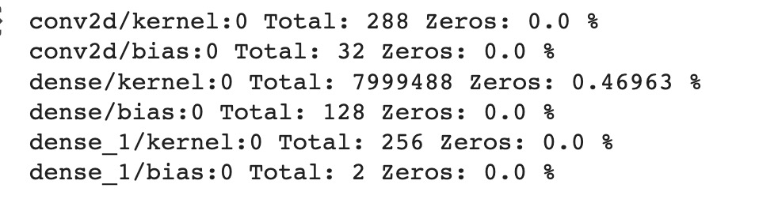

AC215-Milestone3
==============================

AC215 - Milestone3

Project Organization
------------
      ├── LICENSE
      ├── README.md
      ├── requirements.txt
      └── notebooks
            ├── crycrybaby_poc_cleaned.ipynb
            ├── crycrybaby_poc_wandb.ipynb
            ├── model2.ipynb
            ├── model1.ipynb
      └── src
            ├── download_from_dac
            │   ├── Dockerfile
            │   ├── Pipfile
            │   ├── Pipfile.lock
            │   ├── docker-shell.sh
            │   └── download_from_dac.py
            ├── preprocessing
            │   ├── Dockerfile
            │   ├── Pipfile
            │   ├── Pipfile.lock
            │   ├── docker-shell.sh
            │   └── preprocessing.py
            ├── dataversion
            │   ├── Dockerfile
            │   ├── Pipfile
            │   ├── Pipfile.lock
            │   ├── docker-shell.sh
            │   └── cli.py
            ├── model1
            │   ├── Dockerfile
            │   ├── Pipfile
            │   ├── Pipfile.lock
            │   ├── docker-shell.sh
            │   └── model1.py
            └── model2
            |   ├── Dockerfile
            │   ├── Pipfile
            │   ├── Pipfile.lock
            │   ├── docker-shell.sh
            │   └── model2.py
  

--------
# AC215 - Milestone3 - Cry Cry Baby

**Team Members**
Jessica Gochioco, Jingwen Zhang, Adam Stone, Charline Shen

**Group Name**
Cry Cry Baby

**Project**
Parenting is a rewarding yet challenging journey that millions of individuals embark on each year. One of the most difficult aspects of caring for a baby is understanding and addressing their needs, especially when they have not yet learned how to talk. Our project centers on the application of the Dunstan Baby Language (DBL) , a concept suggesting that infants possess distinct vocal cues for various needs, and the development of a mobile app that leverages this knowledge. This app aims to empower parents by enabling them to decode their baby's cries and respond effectively, thereby reducing the stress associated with early parenthood. Furthermore, our project envisions a feature to have caretakers self-identify cries in order to add to our dataset, as well as the integration of a chatbot that can offer real-time support and guidance to parents.

### Milestone3 ###
Our main datasource will come from the Donate-a-Cry Corpus  (https://github.com/gveres/donateacry-corpus/tree/master, cleaned and updated version). We parked our dataset in a private Google Cloud Bucket. 

**Experiment Tracking**

Please see our output from Weights & Biases below. This tool helps us keep track of model training. Unfortunately, our validation accuracy did not increase so we'll have to go back to the drawing board! 

**Serverless Training**

(Unfortunately, Google has not yet updated our quota per our request.)

### Milestone4 ###

**Model Compression**
We used a model compression technique(model pruning) on model 1. Here are some comparation of before and after pruning models.

Pictures of accuracy, weight analysis, and disk space before Prune:

Pictures of accuracy, weight analysis, and disk space before Prune:

**Preprocess container**
- This container reads all the audio files (in .wav format), translate them into spectrogram (in .npy format), and stores it back to GCP
- Source and destincation GCS location are preset in `preprocessing.py`. Input to this container is secrets files - via docker
- Output from this container stored at GCS location

(1) `src/preprocessing/preprocessing.py`  - Here we first download audio files from GCP,  convert our audio files into numerical representation called spectrogram, normalize each matrices, and save the X & y data for our model on GCS. 

(2) `src/preprocessing/Dockerfile` - This dockerfile starts with  `python:3.8-slim-buster`. This <statement> attaches volume to the docker container and also uses secrets to connect to GCS.

(3) `src/preprocessing/Pipfile` - This file will be used by the Pipenv virtual environment to manage project dependencies.

(4) `src/preprocessing/Pipfile.lock` - This file replaces the requirements. txt file used in most Python projects and adds security benefits of tracking the packages hashes that were last locked

(5) `src/preprocessing/docker-shell.sh` - This shell file grabs credentials from GCP and automates the execution of Dockerfile.

**Data Version Container**
- This container load processed spectrogram files from GCP, double the data data size by adding random noises between 0-0.01, and track data versions via `dvc`. 

(1) `src/dataversion/cli.py`  - Here we first download spectrogram files from GCP, do a simple data augmentation to double the data size, and then upload the versioned data to GCP buckets via `dvc`. 

(2) `src/dataversion/Dockerfile` - This dockerfile starts with  `python:3.8-slim-buster`. This <statement> attaches volume to the docker container and also uses secrets to connect to GCS.

(3) `src/dataversion/Pipfile` - This file will be used by the Pipenv virtual environment to manage project dependencies.

(4) `src/dataversion/Pipfile.lock` - This file replaces the requirements. txt file used in most Python projects and adds security benefits of tracking the packages hashes that were last locked

(5) `src/dataversion/docker-shell.sh` - This shell file grabs credentials from GCP and automates the execution of Dockerfile.

**Model Container 1**
- This container does binary classification to classify audio data into cry and non cry data. We load augmented spectrogram files from GCP, train the model, and save the model in GCP bucket for downstream inference container.

(1) `src/model1/model1.py`  - Here we first download spectrogram files from GCP, train the model, and save the model in GCP bucket for downstream inference container. 

(2) `src/model1/Dockerfile` - This dockerfile starts with  `python:3.8-slim-buster`. This <statement> attaches volume to the docker container and also uses secrets to connect to GCS.

(3) `src/model1/Pipfile` - This file will be used by the Pipenv virtual environment to manage project dependencies.

(4) `src/model1/Pipfile.lock` - This file replaces the requirements. txt file used in most Python projects and adds security benefits of tracking the packages hashes that were last locked

(5) `src/model1/docker-shell.sh` - This shell file grabs credentials from GCP and automates the execution of Dockerfile.

**Model Container 2**
- This container load augmented spectrogram files from GCP, convert data to TF.data format, train the model, and save the model in GCP bucket for downstream inference container. 

(1) `src/model/model2.py`  - Here we first download spectrogram files from GCP, convert data to TF.data format, train the model, and save the model in GCP bucket for downstream inference container. 

(2) `src/model/Dockerfile` - This dockerfile starts with  `python:3.8-slim-buster`. This <statement> attaches volume to the docker container and also uses secrets to connect to GCS.

(3) `src/model/Pipfile` - This file will be used by the Pipenv virtual environment to manage project dependencies.

(4) `src/model/Pipfile.lock` - This file replaces the requirements. txt file used in most Python projects and adds security benefits of tracking the packages hashes that were last locked

(5) `src/model/docker-shell.sh` - This shell file grabs credentials from GCP and automates the execution of Dockerfile.

**Mock Submission**

The following is an example of running preprocessing container. You could run other containers by changing the path to directory and the python script you run.

***To open the container:***

0. Send an email to charlineshen@g.harvard.edu with your email address associated with your GCP account. We would add you as an editor to our GCP project.
1. [Login GCP, select ac215-project-400018, start the VM instance] 
2. Open a GCP terminal, change directory into /home/charlineshen/AC215_CryCryBaby/src/preprocessing folder
3. Run `docker-shell.sh` using command: `sudo sh docker-shell.sh`
4. Inside the container, run preprocessing using command: `python preprocessing.py`
5. `preprocessing.py` would download audio files from GCP bucket, transform audio files into spectrograms(matrices in .npy files), and then upload the processed files to GCP bucket. You could observe the updates in Cloud Storage - Buckets in your GCP project.
6. Stop VM instance!

**Notebooks** 
 (This folder contains code that is not part of container - for e.g: EDA, any 🔍 🕵️‍♀️ 🕵️‍♂️ crucial insights, reports or visualizations. Note, currently all notebooks are very messy and will be cleaned up later!)

 (1) `crycrybaby_poc_cleaned.ipynb` - Baseline model
 
 (2) `crycrybaby_poc_wandb.ipynb` - Baseline model and a VGG-ish model to try out Weights & Biases
 
 (3) `model2.ipynb` - A cleaned up version of model 2 with TF datasets, weights & Biases, and VGG-ish model.

 (4) `model1.ipynb` - A version of model 1 with model compression(pruning).

